# 前言

> Properly managing memory on iOS devices is extremely important, since not doing so will get a game terminated by the OS, resulting in what a user would perceive as a crash, Users usually don't like when games crash and tend to leave one-star reviews.
> To assess a game's memory consumption, it is advised to frequently profile the game on target devices, looking for crashes and memory leaks. For this purpose Unity and Apple provide profiling tools which if used correctly can tell a Unity developer everything she needs to know about the game.
>
> The tools provided are the following:
>
> 1. [Unity Memory Profiler](# Unity Profiler)
>
>  	2. [MemoryProfiler(on BitBucket)](# MemoryProfiler( on BitBucket ))
>  	3. [MemoryProfiler Extension(on Github)](# MemoryProfiler Extension(on Github))
>  	4. [Xcode memory gauge in Debug Navigator view](# Xcode Memory Gauge )
>  	5. [VM Tracker Instrument](# VM Tracker Instrument)
>  	6. [Allocations Instrument](# Allocations Instrument)

正确的管理IOS设备的内存的内存非常的重要，因为如果不这样做将使游戏被系统所终止，从而导致用户认为这是一个崩溃。用户通常不喜欢游戏崩溃并且会使他倾向于给与差评。

为了评估游戏的内存消耗，建议经常在目标设备上分析游戏，以查找crash和内存泄漏。为此Unity和Apple提供了性能分析工具，使用得当的话，它可以告诉开发者关于游戏中他想要了解的一切。

# Kinds of Memory

> When a developer asks the question “how much memory does my game use?’ usually one of these tools has a good answer. The problem, however, is that the question is ambiguous — the word “memory” can mean several different kinds of memory. So it is critical to understand what kind of memory the question is referring to. The existence of different kinds of memory is what creates a layer of confusion and deems the topic of memory on iOS too complicated to bother.
> This document describes the nature of memory in iOS and goes into details of what data the mentioned tools provide. The information provided is applicable to other platforms, but differences in implementation are not discussed here.

当开发人员问“我的游戏使用了多少内存？”时，通常其中一种工具会提供很好的答案。但是这个问题是模糊不清的，对于**“内存”**可能意味着几种不同类型的内存。因此，了解该问题指的是哪种内存至关重要。各种内存的存在造成了一片混乱，并认为IOS中关于内存的话题过于复杂。

本文档介绍了IOS中内存的性质，并详细介绍了上述工具提供的数据。提供的信息适用于其他平台，但是此处不讨论实现上的差异。

## System Memory

### Physical Memory (RAM)

> Physical Memory is the physical device memory on-chip inside an iPhone or iPad. It has a physical limit (for example 512Mb or 1Gb) and just can't hold more data. Each running application occupies some amount of Physical Memory, but in modern operating systems (like iOS) applications never work directly with memory on-chip. Instead, they deal with so-called Virtual Memory which the OS seamlessly maps into Physical Memory.

物理内存是iPhone或iPad内寄存器上的物理设备内存。它具有物理限制（例如512Mb或1Gb），并且不能容纳更多数据。每个正在运行的应用程序都占用一定大小的物理内存，但是在现代操作系统（如IOS）中，应用程序永远无法直接使用物理内存。取而代之，它们使用所谓的虚拟内存，操作系统将其无缝映射到物理内存。

### Virtual Memory (VM)

> Virtual Memory is what the game sees as its address space, where it can allocate memory and hold pointers to that memory.
> When a process starts, the OS creates a logical address space (or “virtual” address space) for the process. It's called "virtual" because the address space exposed to the process does not necessarily align with the physical address space of the machine, or even the virtual address space of other applications.

虚拟内存是游戏视为其地址空间的东西，它可以分配内存并持有指向该内存的指针。

当一个进程启动时，操作系统为该进程创建一个逻辑地址空间（或 "虚拟 "地址空间）。它被称为 "虚拟"，因为暴露给进程的地址空间不一定与机器的物理地址空间一致，甚至与其他应用程序的虚拟地址空间也不一致。

> The OS divides this address space into uniformly-sized chunks of memory called pages. The processor and its memory management unit (MMU) maintain a page table to map pages in the process's logical address space to hardware addresses in the computer's RAM. When an applications code accesses an address in memory, the MMU uses the page table to translate the specified logical address into the actual hardware memory address. This translation occurs automatically and is transparent to the running application.

操作系统将这个地址空间划分为统一大小的内存块，称为**"页"**。处理器和它的内存管理单元（MMU）维护一个页表，将进程的逻辑地址空间中的页映射到计算机RAM中的硬件地址。当应用程序代码访问内存中的一个地址时，MMU使用页表将指定的逻辑地址转换为实际的硬件内存地址。这种转换是自动发生的，对运行中的应用程序是透明的。

> In earlier versions of iOS, the size of a page is 4 kilobytes. In later versions of iOS, A7- and A8-based systems expose 16-kilobyte pages to the 64-bit userspace backed by 4-kilobyte physical pages, while A9 systems expose 16-kilobyte pages backed by 16-kilobyte physical pages.
> Virtual Memory consists of several regions, including code segments, dynamic libraries, GPU driver memory, malloc heap and others.

在早期版本的iOS中，一个页面的大小是4千字节。在后来的iOS版本中，基于A7和A8的系统向64位用户空间暴露了16千字节的页面，由4千字节的物理页面支持，而A9系统暴露了16千字节的页面，由16千字节的物理页面支持。

虚拟内存由几个区域组成，包括代码段、动态库、GPU驱动内存、malloc堆和其他。

### GPU Driver Memory

> GPU Driver Memory consists of allocations in Virtual Memory used by the driver and essentially being video memory on iOS.
> iOS features so-called unified architecture, where CPU and GPU share the same memory (though on modern hardware GPU has higher bandwidth to this memory). The allocations are done by the driver and mostly consist of texture and mesh data.

GPU驱动内存由驱动使用的虚拟内存中的分配组成，基本上是iOS上的视频内存(video memory)。

iOS具有所谓的统一架构，CPU和GPU共享相同的内存（尽管在现代硬件上GPU有更高的带宽到这个内存）。这些分配是由驱动程序完成的，主要包括纹理和网格数据。

### Malloc Heap

> Malloc Heap is a Virtual Memory region where an application can allocate memory using malloc and calloc functions.
> In other words, this is a chunk of virtual address space available for the application's memory allocations.
> Apple doesn't publish the maximum size of Malloc Heap. In theory, Virtual Memory address space is only limited by pointer size, which is defined by the processor architecture, i.e., roughly 4 gigabytes of logical memory space on 32-bit processors, and 18 exabytes on 64-bit processors. But in reality, the actual limits seem to depend on device and iOS version and are much lower than one might think. A simple app which continuously allocates Virtual Memory gives the following values:

Malloc Heap是一个虚拟内存区域，应用程序可以使用malloc和calloc函数分配内存。

换句话说，这是一块可供应用程序分配内存的虚拟地址空间。

苹果公司并没有公布Malloc Heap的最大尺寸。理论上，虚拟内存地址空间只受指针大小的限制，而指针大小是由处理器架构定义的，即在32位处理器上大约有4千兆字节的逻辑内存空间，在64位处理器上大约有18兆字节。但实际上，实际限制似乎取决于设备和iOS版本，比人们想象的要低得多。一个持续分配虚拟内存的简单应用给出了以下数值。

> Theoretically, itis possible to exhaust Virtual Memory address space by using too many memory-mapped files.

理论上，通过使用过多的内存映射文件，有可能耗尽虚拟内存地址空间。

### Resident Memory

> Resident Memory is the amount of Physical Memory the game actually uses.
> A process can allocate a block of memory from Virtual Memory, but for the OS to actually reserve a corresponding block of Physical Memory the process has to write to this block. In this case, the allocated block of memory will become a part of the application's Resident Memory.

常驻内存是游戏实际使用的物理内存的大小。

一个进程可以从虚拟内存中分配一个内存块，但是为了让操作系统实际保留一个相应的物理内存块，该进程必须向这个内存块写入。在这种情况下，分配的内存块将成为应用程序常驻内存的一部分。

### Paging

> Paging is a process of moving Physical Memory pages in and out from memory to a backing store.
> When a process tries to allocate and use a block of Virtual Memory, the OS looks for free memory pages in Physical Memory and maps them to the allocated Virtual Memory pages (thus making these pages a part of the application's Resident Memory).

分页是一个将物理内存页从内存中移入和移出到后备存储的过程。

**当一个进程试图分配和使用一个虚拟内存块时，操作系统在物理内存中寻找空闲的内存页，并将它们映射到分配的虚拟内存页（从而使这些页成为应用程序常驻内存的一部分）。**

> If there are no free pages available in Physical Memory, the OS tries to release existing pages to make room for the new pages. How the system releases pages depend on the platform. Usually, some pages deemed rarely used are moved to a backing store like a page file on disk. This process is known as paging out.
> But in case of iOS, there is no backing store, so pages are never paged out to disk. Though, read-only pages can still be removed from memory and reloaded from disk as needed. This process is known as paging in.

如果物理内存中没有可用的页面，操作系统会尝试释放现有的页面，以便为新的页面腾出空间。系统如何释放页面取决于平台。通常，一些被认为很少使用的页面会被移到一个像磁盘上的页面文件一样的后备存储中。这个过程被称为 "paging out"。

但在iOS中，没有后备存储，所以页面永远不会被分页到磁盘。不过，只读的页面仍然可以从内存中删除，并在需要时从磁盘上重新加载。这个过程被称为 "paging in"。

> If an application accesses an address on a memory page that is not currently in Physical Memory, a page fault occurs. When that happens, the Virtual Memory system invokes a special page-fault handler to respond to the fault immediately. The page-fault handler stops the currently executing code, locates a free page of Physical Memory, loads the page containing the needed data from backing store, updates the page table, and then returns control to the program's code.

如果一个应用程序访问一个当前不在物理内存中的内存页上的地址，就会发生一个页故障。当这种情况发生时，虚拟内存系统会调用一个特殊的页面故障处理程序来立即响应这个故障。页面故障处理程序停止当前执行的代码，找到物理内存的一个空闲页面，从备份存储中加载包含所需数据的页面，更新页面表，然后将控制权返回给程序的代码。

### Clean Memory

> Clean Memory is a set of read-only memory pages from applications Resident Memory which iOS can safely remove and reload from disk when needed. Memory allocated for the following data is considered Clean:
> 1. System frameworks,
> 2. Application’s binary executable,
> 3. Memory mapped files.

Clean Memory是一组来自应用程序常驻内存的只读内存页，iOS可以在需要时安全地移除并从磁盘重新加载。以下数据分配的内存被认为是干净的。

1. 系统框架。

2. 应用程序的二进制可执行文件。

3. 内存映射的文件。

> When an application links to a framework, Clean Memory set will increase by the size of the framework binary. But most of the time, only a part of the binary is loaded in Physical Memory.
> Because Clean Memory is read-only, applications can share parts of Clean Memory like common frameworks and libraries, as well as other read-only or copy-on-write pages.

当一个应用程序链接到一个框架时，Clean Memory将会随着框架二进制文件的大小而增加。但是大多数时候，只有二进制文件的一部分被加载到物理内存中。

因为Clean Memory是只读的，所以应用程序可以共享Clean Memory的部分内容，比如通用框架和库，以及其他只读或写入时拷贝（[copy-on-write](https://en.wikipedia.org/wiki/Copy-on-write)）的页面。

### Dirty Memory

> Dirty Memory is a part of Resident Memory which can't be removed by the OS.

脏内存是常驻内存的一部分，不能被操作系统删除。

### Swapped Compressed Memory

> Swapped (Compressed) Memory is a part of Dirty Memory which the OS deemed rarely used and stores in a compressed memory region.
> The algorithm used to move and compress these memory blocks is not open, but tests show that iOS usually aggressively tries to do this, thus reducing the amount of Dirty Memory for the application.

Swapped Compressed Memory是Dirty Memory的一部分，操作系统认为它很少被使用，并存储在一个压缩的内存区域。

用于移动和压缩这些内存块的算法并没有公开，但测试表明，iOS通常会积极地尝试这样做，从而减少应用程序的Dirty Memory的数量

## Unity Memory

> Unity is a C++ game engine with a .NET scripting Virtual Machine. Unity allocates memory for native (C++) objects and memory needed for the Virtual Machine from Virtual Memory. Also, third-party plugins can do their allocations from the Virtual Memory pool.

Unity是一个带有.NET脚本虚拟机的C++游戏引擎。Unity从虚拟内存中为Native（C++）对象分配内存和虚拟机所需的内存。另外，第三方插件可以从虚拟内存池中进行分配。

### Native Memory

> Native Memory is the part of the game's Virtual Memory which is used for native (C++) allocations — here Unity allocates pages for all its needs, including Mono Heap.
>
> Internally Unity has several specialized allocators which manage Virtual Memory allocations for short-term and long-term needs. All the assets in the game are stored in Native Memory, while being exposed as lightweight wrappers for the .NET Virtual Machine. In other words, when a Texture2D object is created in C# code, the biggest part of it, actual texture data, is allocated in Native Memory, not in the Mono Heap (though most of the time it is uploaded “on GPU” and discarded).

Native Memory是游戏虚拟内存的一部分，用于native（C++）的内存分配。在这Unity为其所有需要的分配页，包括Mono Heap。

在内部，Unity有几个专门的分配器来管理虚拟内存的分配，以满足短期和长期的需要。游戏中的所有资产都存储在Native Memory中，同时作为.NET虚拟机的轻量级包装物被暴露出来。换句话说，当一个Texture2D对象在C#代码中被创建时，它的最大部分，即实际的纹理数据，被分配在Native Memory中，而不是Mono Heap中（尽管大多数时候它被上传 "在GPU上 "并被丢弃）。

### Mono Heap

>  Mono Heap is a part of Native Memory allocated for the needs of the NET Virtual Machine. It contains all the managed C# allocations and is maintained by the Garbage Collector.
>
> Mono Heap is allocated in blocks which store managed objects of similar size. Each block can store some amount of such objects and if it stays empty for several GC passes (8 passes in the time of writing on iOS) the block is decommitted from memory (i.e, its Physical Memory is returned to the system). But Virtual Memory address space allocated by the GC is never freed and can't be used by any other allocator in the game.
>
> The issue with the blocks is that they are usually fragmented and might contain just a few objects out of a capacity of thousands. Such blocks are still considered used, so their Physical Memory can't be returned to the system. Unfortunately, this is usually the case in real-world scenarios, while it is easy to construct an artificial example where Mono Heap Resident Memory will grow and shrink at will.

Mono Heap是Native Memory的一部分，为NET虚拟机的需要而分配。它包含所有管理的C#分配，并由垃圾收集器维护。

Mono Heap是以块的形式分配的，它存储类似大小的管理对象。每个区块可以存储一定数量的对象，如果它在几次GC pass 中一直是空的（在iOS上写的时候是8个pass），那么这个区块就会从内存中被去除（也就是说，它的物理内存被退回给系统）。但是GC分配的虚拟内存地址空间永远不会被释放，也不能被游戏中的任何其他分配器使用。

内存块的问题是，它们通常是零散的，可能只包含数千个容量中的几个对象。这样的内存块仍然被认为是使用过的，所以它们的物理内存不能归还到系统中。不幸的是，这通常是现实世界中的情况，而很容易构建一个人为的例子，Mono Heap常驻内存会随意增长和缩小。

# iOS Memory Management

> iOS is a multitasking operating system; it allows applications coexist in the same environment, Each application with its own Virtual Memory address space mapped to some portion of Physical Memory. When the amount of free Physical Memory gets low (either because too many applications are loaded, or the foreground application consumes too much Physical Memory), iOS starts trying to reduce memory pressure. 
>
> 1. First, iOS tries to remove some Clean Memory pages, 
> 2. If it deems an application to take too much Dirty Memory, iOS sends a memory warning to the application, expecting it to free some resources, 
> 3. After several memory warnings, if the application still uses a significant amount of Dirty Memory, iOS terminates the application.

iOS是一个多任务操作系统；它允许应用程序在同一环境中共存，每个应用程序都有自己的虚拟内存地址空间，并映射到物理内存的某些部分。当空闲的物理内存数量变少时（要么是因为加载了太多的应用程序，要么是前台应用程序消耗了太多的物理内存），iOS开始尝试减少内存压力。

1. 首先，iOS试图删除一些Clean Memory页
2. 如果它认为一个应用程序占用了太多的脏内存，iOS会向该应用程序发送一个内存警告，希望它释放一些资源
3. 经过几次内存警告后，如果该应用程序仍然使用大量的脏内存，iOS会终止该应用程序。

> Unfortunately, the decision process to kill an application is not transparent. It seems that. this decision depends on total memory pressure, the internal state of kernel memory manager and how many strategies the OS has already tried to minimize the pressure. Only when it exhausts all the strategies, it decides to kill currently active application. That's why sometimes an application can be stopped quite early, while next time it allocates 30% more and still survives.

不幸的是，杀死一个应用程序的决定过程并不透明。这个决定似乎取决于总的内存压力、内核内存管理器的内部状态以及操作系统已经尝试了多少种策略来减少压力。只有当它用尽所有的策略时，它才会决定杀死当前的活动程序。这就是为什么有时一个应用程序可以很早就被停止，而下一次它又分配了30%的内存，仍然可以存活。

> The most important metric to observe trying to investigate OOM crashes is Dirty Memory, because iOS is unable to remove dirty pages to provide free pages for new allocations. This means that to fix memory related issues, a developer must do the following: 
>
> 1. Find out how much Dirty Memory the game uses and if the usage grows over time. 
> 2. Figure out what objects contribute to the game's Dirty Memory and can't be compressed.

**试图调查内存不足的崩溃（OOM Crash）时，最重要的观察指标是Dirty Memory**，因为iOS无法删除脏页来为新分配提供空闲页。这意味着，要修复与内存有关的问题，开发者必须做以下工作。

1. 找出游戏使用了多少Dirty Memory，以及使用量是否随时间增长。
2. 弄清楚哪些对象对游戏的脏内存有贡献，不能被压缩。

> Reasonably safe limit values of Dirty Memory for different iOS devices (from what we have seen in the wild):
> * 180Mb for 512Mb devices,
> * 360Mb for 1Gb devices
> * 1.2Gb for 2Gb devices. 
>
> Note that even if your application falls under these recommended limits, eviction from iOS is still possible. Going beyond this further increases the chance of eviction on iOS.

不同的iOS设备的Dirty Memory的合理安全极限值（从我们自然场景中看到的情况来看）。

请注意，即使你的应用程序低于这些建议的限制，仍然有可能被iOS干掉。超出这个范围会进一步增加在iOS上被干掉的机率。

# The Tools

## Unity Profiler

> The Profiler ships with Unity editor and can be used to profile various aspects of the game either in the editor or connected to a device running a Development Build of the game. Memory tab of the Profiler window shows many aggregated statistics about the game's memory usage.

Unity编辑器附带的Profiler，可以在编辑器中或连接到运行游戏开发版本的设备上用于分析游戏的各个方面。Profiler窗口的Memory标签显示了许多关于游戏内存使用情况的综合统计。

### Best Used For

> The Profiler shows the actual named assets occupying Virtual Memory and the number of references to them in the game. It is the most accessible tool to inspect what assets are in memory and why they are there. Other tools show a lot more details about allocations and the code doing these allocations, but it is tough to find out what exactly was allocated and why it is still in memory.
>
> The Profiler also shows the actual size of Mono Heap.

Profiler显示了占用虚拟内存的实际命名的资产和游戏中对它们的引用数量。它是检查哪些资产在内存中以及它们为什么在那里的最方便的工具。其他工具显示了更多关于分配和进行这些分配的代码的细节，但要找出到底分配了什么以及为什么它一直存在在内存中是很困难的。

Profiler也显示了MonoHeap的实际大小。

### SimpleView

> Unity reserves memory pools for allocations in Native Memory to avoid asking the OS too often — this is displayed as “Reserved.” The amount of Reserved memory actually used by Unity is displayed as “Used.”
>
> The “Simple” view displays the amount of Virtual Memory allocated for the following (provided for iOS/Metal, might be different on other platforms): 

Unity为Native Memory的分配保留了内存池，以避免经常询问操作系统 - 这显示为 "Reserved"。Unity实际使用的保留内存的大小显示为 "Used"。

"SimpleView "视图显示分配给以下的虚拟内存的数量(图片提供的为iOS/Metal，在其他平台上可能不同):

- **GfxDriver** — the total size of textures excluding render targets (doesn't include many other driver allocations)

  纹理的总大小，不包括渲染目标（不包括许多其他驱动分配）。

- **FMOD** — the overall size of memory requested by FMOD for audio playback

  FMOD为音频播放所要求的内存的总大小

- **Profiler** — Profiler overhead

  分析器的开销

- **Video** — the memory used for playing video files

  用于播放视频文件的内存

- **Mono**

  - **Reserved** — the total Resident Memory size of used and unused memory blocks of Mono Heap

    已使用和未使用的Mono Heap内存块的总常驻内存大小

  - **Used** — the total Resident Memory size of used memory blocks (i.e. the current size of Mono Heap)

    已使用的总常驻内存大小（即Mono Heap的当前大小）。

  - **Note**: the actual size of managed objects is less than Used size and is not shown here

    被管理对象的实际尺寸小于使用的尺寸，在此不作显示。

- **Unity** — all reserved and used memory managed by Unity allocators minus Profiler、Video and FMOD (i.e, including Mono Heap)

  由Unity分配器管理的所有保留和使用的内存，减去Profiler、Video和FMOD（即，包含Mono Heap）。

- **Total** — Unity + GfxDriver + Profiler (not including Video and FMOD for some reason)

  Unity + GfxDriver + Profiler (由于某些原因不包含Video和FMOD)

  

> The Total Reserved memory is by no means the accurate value of Virtual Memory allocated by the game: 
>
> 1. This data doesn't include the size of the game's binary executables, loaded libraries, and frameworks.
> 2. GfxDriver value doesn't include render targets and various buffers allocated by the driver. 
> 3. The Profiler only sees allocations done by Unity code; it doesn't see allocations by third-party native plugins and by the OS.

Total Reserved memory 并不意味着准确的游戏分配的虚拟内存值。

​	1. 这个数据不包括游戏的二进制二进制文件，加载的库和框架的大小。

​	2. GfxDriver的值不包括渲染目标和由驱动分配的各种残留。

​	3. 分析器只看到Unity代码维护的分配，它无法看到第三方本地插件和操作系统的分配。

### Detailed View

> The “Detailed” view displays the Virtual Memory allocated by different objects in the engine. It is handy for finding out the actual sizes of the game's assets and whether whether something uses these assets or not.

详细的视窗显示了引擎不同对象分配的虚拟内存。这对与了解游戏资产的实际大小以及某物体是否使用这些资产是很方便的。

- **Assets** — currently loaded assets from scenes, Resources or Asset Bundles

  当前从场景、资源、AB中加载的资产

- **Built-in Resources** — Unity Editor resources or Unity default resources

  Unity 编辑器资源和Unity默认资源

- **Not Saved** — GameObjects marked as DontSave

  被标记为“不保存”的GameObjects

- **Scene Memory** — GameObject and attached components

  GameObject和其附带的组件

- **Other** — objects not assigned in the above categories

  不属于上述类别的对象

通常情况下，最有趣的数据可以在资产部分找到。

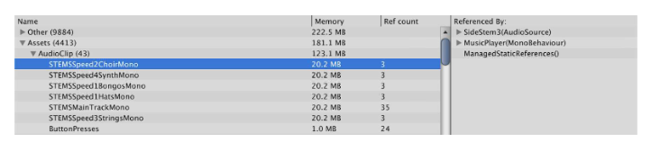

例如，这里可以看出，声音压缩设置是错误的，这些音频片段占用了太多的内存。

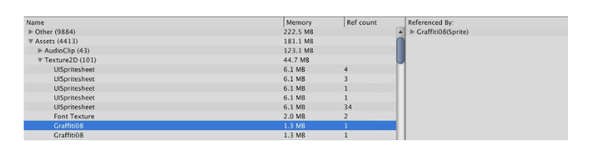

在这个视图中，也很容易发现名称相同的重复纹理。并非所有具有相同名称的纹理都是重复的，但通常检查一下是个好主意。

Not Saved和Scene Memory部分可能包含动态创建的资产，这些资产没有被GC。泄漏的资产可以通过Ref count列中没有数值来识别，这意味着没有其他资产或代码在引用它。

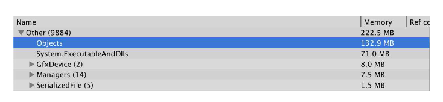

The most significant contributors to the memory pool in Other section are actually misleading

Other 中对内存池占用最多部分实际上是误导。

- **Objects** — objects are various classes that derive from NamedObject, i.e. GameObjects, Textures, Meshes, Components, etc. This value should be the sum of objects from other sections, but it seems that it got broken at some point and is not relevant anymore, In any case, this is not “some other objects on top of already allocated memory” and can be ignored.

  对象是派生自NamedObject的各种类，即GameObjects, Textures, Meshes, Components, 等等。这个值应该是其他部分的对象的总和，但似乎它在某个时候被破坏了，不再有意义了，在任何情况下，这不是 "已经分配的内存上的一些其他对象"，可以忽略。

- **System.ExecutableAndDlls** — Unity tries to guess the memory consumed by loaded binary code by summing up file sizes. <...>

  Unity试图通过总结文件大小来猜测加载的二进制代码所消耗的内存。

- **ShaderLab** — these are all allocations related to compiling shaders. Shaders themselves have their own object root and are listed under Shaders.

  这些都是与编译着色器有关的分配。Shaders本身有自己的对象根，并被列在Shaders下。

## MemoryProfiler(on BitBucket)

> This is an experimental tool based on Memory API introduced in Unity 5.3. When connected to a game built with IL2CPP, it can graph memory regions Unity knows about. The tool is available on BitBucket and is not shipped with Unity.

这是一个基于Unity 5.3中引入的Memory API的实验性工具。当连接到用IL2CPP构建的游戏时，它可以绘制Unity所知道的内存区域。该工具可在BitBucket上使用，但不随Unity一起提供。

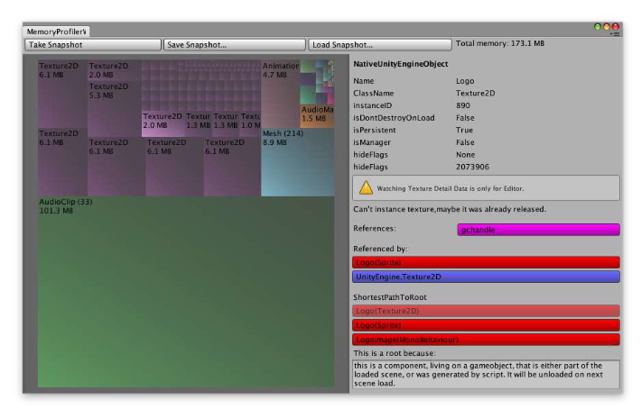

这个工具通过以下方式增加了Profiler的数据：

1. Proportionally drawing the size of allocations 

   按比例画出分配的大小

2. Saying why these allocations are still in memory (who references them)

   说明为什么这些分配还在内存中（谁引用了它们）

3. It shows managed objects.

   它显示了管理对象。

   

例如，这是一个由该工具显示的字符串阵列：

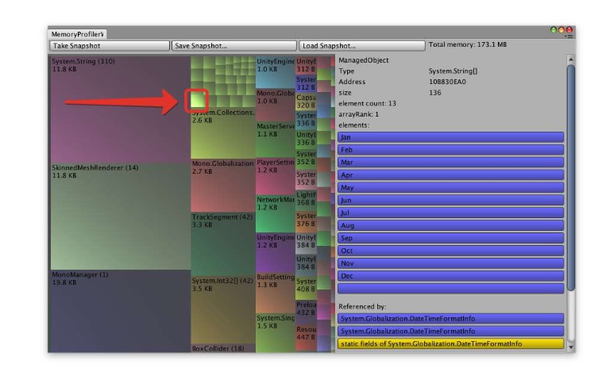

### Best Used For

> MemoryProfiler is a great tool to visually map Native Memory and find groups of managed objects which occupy too much of it.

MemoryProfiler是一个很好的工具，可以直观地映射Native Memory，并找到占用过多内存的管理对象组。

## MemoryProfiler Extension(on Github)

> Using the same memory API the previous tool utilizes, Unity Support Team has prototyped an extended tool which can visualize Mono Heap. It is available on Github.

使用之前的工具所使用的相同的内存API，Unity支持团队已经制作了一个扩展工具的原型，可以将Mono Heap可视化。[Github](https://github.com/robertoardila/support-unity-memoryprofiler)

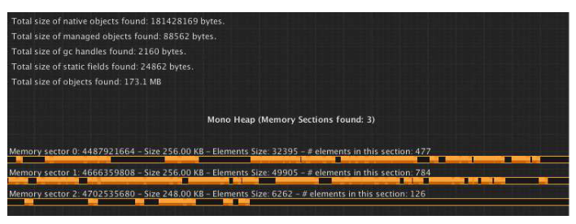

### Best Used For

> This tool nicely displays the structure of Mono Heap and is a great instrument to learn how memory for the heap is allocated and used.

这个工具很好地显示了Mono Heap的结构，是学习堆的内存如何分配和使用的一个好工具。

## Xcode Memory Gauge 

> When running an application from Xcode, the IDE shows a few gauges in Debug Navigator View, one of which displays a number corresponding to currently used memory.

当从Xcode中运行一个应用程序时，IDE在Debug Navigator View中显示一些仪表，其中一个显示对应于当前使用的内存的数字。

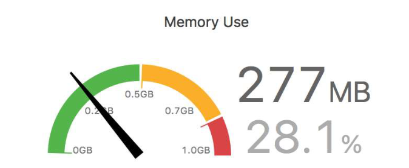

> Unfortunately, it is not entirely known what this bar shows. The maximum value is the total size of Physical Memory. The value seems to be 10-15MB larger than Dirty Memory + Swapped Memory reported by VM Tracker Instrument discussed further. It seems that when the value gets into the yellow zone, the application is soon terminated by the OS.

不幸的是，目前还不完全知道这个条形图显示的是什么。最大值是物理内存的总大小。该值似乎比VM Tracker Instrument报告的Dirty Memory + Swapped Memory大10-15MB，并进一步讨论。似乎当这个值进入黄色区域时，应用程序很快就被操作系统终止了。

> It is wrong to say that this single number is the only one used to decide when to terminate an application. As mentioned in “iOS Memory Management” section, the actual process is not that straightforward.

如果说这个单一的数字是决定何时终止应用程序的唯一数字，那是错误的。正如在 "**iOS Memory Management** "一节中提到的，实际的过程并不是那么简单的。

### Best Used For

> The value displayed by this gauge is rather a heuristic to see if the application is doing OK memory wise or not. It should be used only to observe the overall trend of the application memory consumption. For precise profiling, developers are advised to use Instruments,

这个仪表显示的值是一个参考，可以看到应用程序在内存方面是否做得不错。它应该只被用来观察应用程序内存消耗的总体趋势。对于精确的分析，我们建议开发者使用 **Instrument**。

## VM Tracker Instrument

> The VM Tracker instrument captures information about Virtual Memory usage by a process. It shows all memory blocks in the application's address space labeled with the block type and which library reserved it. For each reserved memory block, the tool displays its size in Virtual Memory, as well as how much Resident, Dirty and Swapped Memory the block takes.

VM Tracker Instrument捕获关于进程的虚拟内存使用的信息。它显示了应用程序地址空间中的所有内存块，并标明了块的类型和哪个库保留了它。对于每个保留的内存块，该工具显示其在虚拟内存中的大小，以及该内存块占用多少常驻内存、脏内存和交换内存。

### Best Used For

> VM Tracker gives the most detailed information about the state of a process’ memory and is the only tool which reports the size of its Dirty Memory set. Other interesting details include the size of graphics driver allocations (essentially the Video Memory), the size of application binaries in memory and the total volume of reserved and committed Mono Heap.
> Unfortunately, the tool doesn't report what the memory is allocated for and when. For this purpose, we advise using Allocations Instrument and Unity Profiler.

VM Tracker提供了关于进程内存状态的最详细的信息，并且是唯一能报告其Dirty Memory集大小的工具。其他有趣的细节包括图形驱动分配的大小（基本上是视频内存），内存中应用程序二进制文件的大小以及保留和提交的Mono Heap的总量。

不幸的是，该工具并没有报告内存被分配的目的和时间。为了这个目的，我们建议使用Allocations Instrument和Unity Profiler。

### Starting a Profiling Session

> To profile a game with Instruments, it must either be launched from a specific Instrument or the Instrument must be connected while the game is launched. To start profiling from Xcode, the game must be launched using Profile button, and the Allocations instrument must be chosen.

要用工具对游戏进行剖析，必须从一个特定的工具启动，或者在游戏启动的同时连接工具。要从Xcode开始分析，必须使用Profile按钮启动游戏，并且必须选择Allocations仪器。

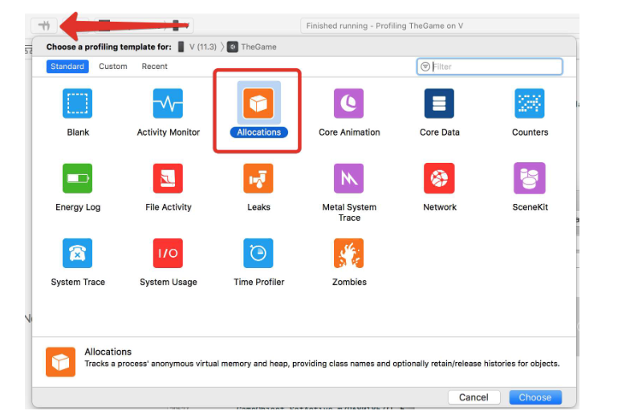

之后，启动游戏按记录按钮

游戏开始后，在时间轴上选择VM Tracker行，手动按下 "立即快照 "按钮或勾选 "Snapshot Now"在特定时间间隔内进行。

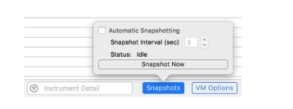

### Data

快照结束后，工具会展示的数据如下：

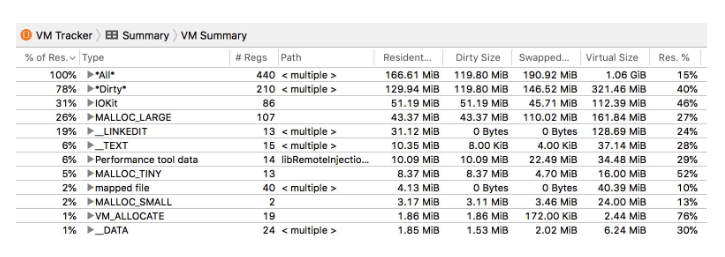

- **Type** — the name of the memory being used

  内存类型

- **Resident Size** — the amount of Resident Memory being used by allocation or a group of allocations

  分配或一组分配所使用的常驻内存大小。

- **Dirty Size** — the amount of Dirty Memory used by allocation or a group of allocations

  被分配或一组分配所使用的Dirty Memory大小

- **Swapped Size** — the amount of Compressed Swapped Memory used by allocation or a group of allocations

  被分配或一组分配使用的压缩交换内存大小。

- **Virtual Size** — the total size of Virtual Memory used by allocation or a group of allocations

  分配或一组分配所使用的虚拟内存的总大小。

- **Res. %** — the percentage of Resident Memory compared to the amount of allocated Virtual Memory.

  常驻内存与分配的虚拟内存数量的百分比。

  

VM Tracker显示每个类型的分配组以及它们对脏内存和虚拟内存的使用程度。最常见的组是：

- **All** — all allocations

  所有的分配

- **Dirty** — a group of all types which contribute to Dirty Memory

  一组所有类型的分配对脏内存的使用

- **IOKit** — graphics driver memory, i.e, render targets, textures, meshes, compiled shaders, etc

  图形驱动内存，即渲染目标、纹理、网格、编译的着色器等

- **VM_ALLOCATE** — mainly allocations for Mono Heap. If this value is large, it is easier to use Unity Profiler to find what managed code is responsible for these allocations

  主要为Mono Heap的分配。如果这个值很大，那么使用Unity Profiler来找到这些分配是由哪些托管代码负责的

- **MALLOC _*** — mainly Unity native allocations or allocations by third-party plugins

  主要是Unity native 分配或由第三方插件分配

- **_TEXT** — non-writable executable code and static data

  不可写的可执行代码和静态数据

- **_DATA** — writable executable code/data

  可写的可执行代码/数据

- **_LINKEDIT** — raw data used by the dynamic linker, such as symbol, string, and relocation table entries.

  动态链接器使用的原始数据，如符号、字符串和重定位表条目。

通过查看组以及它们对虚拟内存和脏内存的使用有多大，很容易开始确定过度内存消耗的来源。

### Regions Map

VM Tracker 有第二个视图，叫做**Regions Map**。这是一个内存区域的列表，包含每个区域的一些信息。通过查看这个视图，可以很容易地看到虚拟内存地址空间对一个进程的结构。

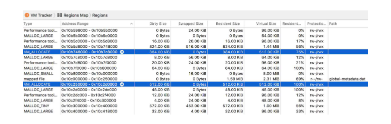

同样清楚的是，例如，Mono Heap块在内存中是不连续的。

## Allocations Instrument

> Allocations Instrument shows individual allocations in the application's address space done by any native code on all threads including Unity native code, Garbage Collector, IL2CPP Virtual Machine, third-party plugins. The tool displays allocations for a selected time frame in a list or in the application's call stack. It is handy to see which code an allocation originated from.

Allocations Instrument显示应用程序地址空间中由所有线程上的任何本地代码完成的单个分配，包括Unity本地代码、垃圾收集器、IL2CPP虚拟机、第三方插件。该工具在列表中或应用程序的调用堆栈中显示选定时间段的分配。它可以很方便地看到分配是来自于哪个代码。

### Best Used For

> Allocations Instrument is very useful for reviewing native allocations at any point in the application's lifecycle. It shows what code made the allocation, from which sometimes it is possible to infer what was allocated and why.

Allocations Instrument对于审查应用程序生命周期中任何时候的本地分配是非常有用的。它显示了哪些代码进行了分配，有时可以从中推断出分配的内容和原因。

### Starting a Profiling Session

该仪器与VM Tracker耦合在一起，所以启动程序是一样的。要查看仪器收集的数据，在时间线视图中选择其行，并在该行上选择一个时间段（通过点击和拖动）。

建议设置如下：

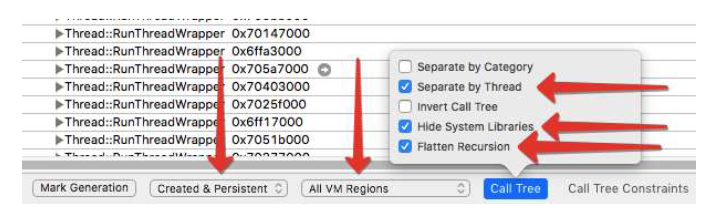

### Data

工具中最有用的视图是调用树视图。它显示应用程序每个线程的调用栈，以及每个分支总共分配了多少内存。

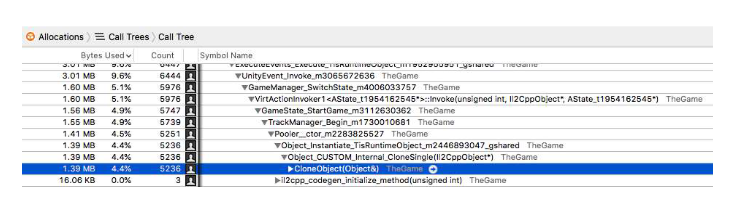

这里是源于`UnityEvent.Invoke`的部分游戏代码。Invoke的部分代码。很明显，这段代码创建了一个`Pooler`类的实例，它克隆了一些prefabs，从而为其副本分配了内存。

所有为.NET虚拟机的需要而分配的虚拟内存都可以在以下类别中找到。

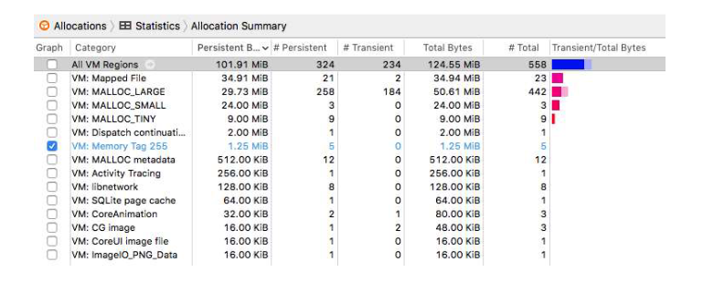

点击类别可以看到所有单个的信息。

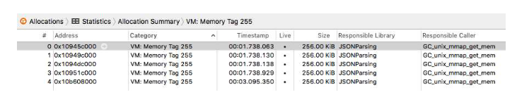

该工具方便地显示了所选分配的代码来源。在这种情况下，前四个分配是在初始化IL2CPP运行时完成的。

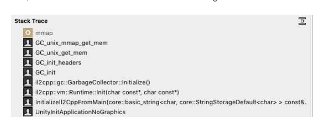

但最后一次分配是在试图初始化一个受管对象时进行的。

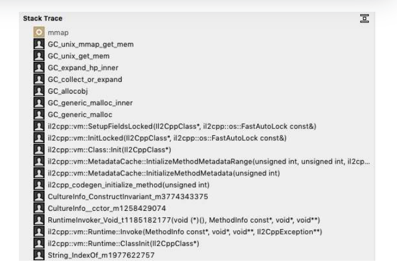